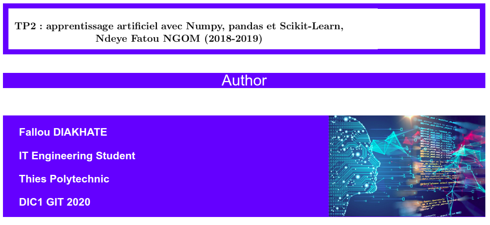
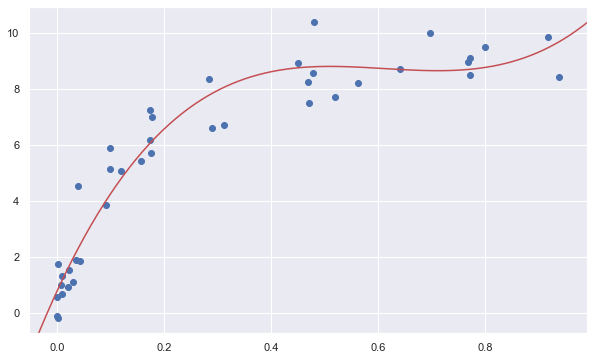
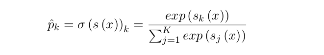
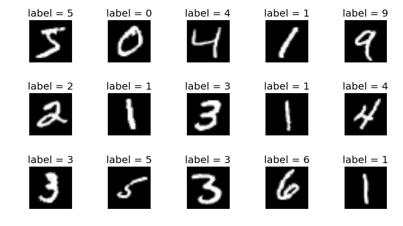

<hr>
<div>
    
</div>

<hr>
       
<h1><center style="color:white; background-color : blue;">Table of contents</center></h1>


<div class="alert alert-block alert-info" style="margin-top: 20px">
    <ol>
        <li><a href="#about_dataset">Exercice 1 :  Descente de Gradient</a></li>
        <li><a href="#visualization_analysis">Exercice 2 : Sélection de modèles</a></li>
        <li><a href="#visualization_analysis">Exercice 3 : Classement : régression logistique</a></li>
        <li><a href="#visualization_analysis">Exercice 4 :  Classfification</a></li>
    </ol>
</div>
<br>
<hr>
    

   
    


<h2 ><center style = "background-color : blue; color :white">EXERCICE 1 : DESCENTE DE GRADIENT</center></h2>
<HR>

`1.Rappelons la fonction coût du modèle de régression linéaire h (x).`

<hr>

<hr>

`2.Rappelons les étapes de l’algorithme de descente de gradient.`

<hr>


*  Initialisation aléatoire des paramètres theta du modèle. 
* Le Calcul de  e∇θMSE(θ) est effectué. Ce dernier est un vecteur gradient composé de toutes les dérivées partielles de la fonction de coût et X le jeu de données d’entraı̂nement.
* Soustraire ∇ θ MSE (θ) de θ et multiplier le taux d’apprentissage η par la vecteur gradient qui permet de déterminer le pas de progression vers le bas θ − η∇ θ MSE (θ)
* De nouvelles itérations des paramètres teta sont effectuées jusqu'à ce que  la norme du vecteur gradient devient inférieure à une tolérance epsilon.
<hr>

`3. Pour la suite, nous souhaitons implémenter la descente de gradient
ordinaire (nb : interprétation des scripts)`

`3.a Ecrivons une fonction permettant de caculer h (x) en fonction de
theta0 et theta1 en nous inspirant du script qui suit`

* Importations des modules python


```python
import numpy as np
import pandas as pd
import matplotlib . pyplot as plt
import matplotlib . animation as animation
import matplotlib as mlt
```

* Script


```python
def cost_function ( theta0 , theta1 ):
    
    #initialisation
    global_cost = 0
    
    # m est le nombre d'observations de la matrice X
    m =  len (X )
    
    #On parcourt l'ensemble des observations pour calculer la fonction de coût
    for i in range (m):
        cost_i = (( theta0 + ( theta1 * X[i ])) - Y[i])**2
        global_cost = global_cost + cost_i
        
    return (1/ (2 * m)) * global_cost
```

`3.b Ecrivons une fonction qui permet de calculer la dérivée partielle des
paramètres theta0 et theta1.`


```python
def derivees_partielles ( ancien_theta0 , ancien_theta1 ):
    
    derivee_theta0 = float (0)
    derivee_theta1 = float (0)
    M = len(X)
    
    for i in range (0 , len (X )):
        
        derivee_theta0 += float((( ancien_theta0 + (ancien_theta1 * X[i])) -float (Y[i ])))
        derivee_theta1 += (((ancien_theta0 + (ancien_theta1 * X[i ])))-float(Y[i])) * float (X[i])
        
    derivee_theta0 = (1/ M) * derivee_theta0
    derivee_theta1 = (1/ M) * derivee_theta1
    
    return [ derivee_theta0 , derivee_theta1 ]
```

`3.c Ecrivons une fonction qui permet de calculer itérativement theta en fonction du learning rate.`


```python
def nouvelles_theta ( ancien_theta0 , ancien_theta1 ):
    
    COST_RECORDER = []
    [derivee_theta0 , derivee_theta1] = derivees_partielles(ancien_theta0 , ancien_theta1)
    nouvelle_theta0 = ancien_theta0 - (learning_rate_ALPHA * derivee_theta0)
    nouvelle_theta1 = ancien_theta1 - (learning_rate_ALPHA * derivee_theta1)
    COST_RECORDER.append(cost_function(nouvelle_theta0 , nouvelle_theta1))
    
    return [ nouvelle_theta0 , nouvelle_theta1 ]
```

`3.d En s’appuyant sur ces dernières fonctions, implémentons la descente de gradient.`

* Implémentation de la descente de gradient


```python
def gradient_descent(X, Y, initial_theta0, initial_theta1, learning_rate_ALPHA, nombre_iterations):
    
    tmp_theta0 = initial_theta0
    tmp_theta1 = initial_theta1
    
    for i in range (nombre_iterations):
        
        [nouvelle_theta0 , nouvelle_theta1 ] = nouvelles_theta(tmp_theta0 , tmp_theta1)
        tmp_theta0 = nouvelle_theta0
        tmp_theta1 = nouvelle_theta1
        
    return [tmp_theta0 , tmp_theta1]
```

* Les données d'entrainement 


```python
X = np. array ([1 , 2 , 3 , 4 , 5])
Y = np. array ([4 , 2 , 1 , 3 , 7])
```

* Utilisation de la fonction


```python
nombre_iterations = 1000
learning_rate_ALPHA = 0.01
[final_theta0 , final_theta1 ] = gradient_descent(X, Y, 1, 2, 0.01, 1000)

print (" Aprés {0} iterations : theta0 = {1} , theta1 = {2} ".format(
nombre_iterations , final_theta0 , final_theta1 ))

```

     Aprés 1000 iterations : theta0 = 1.1870970341704947 , theta1 = 0.7312723111298938 


<HR>
<h2 ><center style = "background-color : blue; color :white">EXERCICE 2 : SELECTION DE MODELES</center></h2>
<HR>

* Importation des modules python et génération des données et visualisation


```python
import numpy as np
import matplotlib.pyplot as plt

plt.figure(figsize=(10, 6))
x = np. array ([1 , 2 , 3 , 4 , 5])
y = np. array ([4 , 2 , 1 , 3 , 7])
plt.scatter (x, y);
```


`1. Testons et interprétons le script qui suit`

* Script


```python
from sklearn . linear_model import LinearRegression

X = x[: , np.newaxis ]
model = LinearRegression().fit(X, y)
Y_fit = model.predict (X)

plt.figure(figsize=(10, 6))
plt.scatter (x, y)
plt.plot (x, Y_fit );
```


* Interprétation du Script

<hr>
Le script ci-dessous permet d'entrainer un modèle de regression lineaire sur les données X et Y generer plutot en utilisant le module LinearRegression de scikit-Learn. Ensuite une visualition graphique du modèle est effectuée.
<hr>

`2. Afin d’améliorer le résultat, un modèle polynomial de degré 3 est utilisé.`


```python
from sklearn . preprocessing import PolynomialFeatures

poly = PolynomialFeatures( degree = 3 , include_bias = False )
X2 = poly.fit_transform(X)
print(X2)
```

    [[  1.   1.   1.]
     [  2.   4.   8.]
     [  3.   9.  27.]
     [  4.  16.  64.]
     [  5.  25. 125.]]


```python
model = LinearRegression().fit(X2 , y)
Y2_fit = model.predict(X2)

plt.figure(figsize=(10, 6))
plt.scatter (x, y)
plt.plot(x, Y2_fit );
```


`2.a Dans le script qui ci-dessous que représente X2 ?`

<hr>
La matrice X2 représente la nouvelle matrice de données obtenue apres la transformation de la première par le module PolynomialFeatures de scikit-Learn. Les données de base sont transformées et de nouvelles variables dérivées de X : X^2 et X^3 sont introduites dans le but de préparer les données pour un modele de regression polynomiale.

Pour resumer X2 = [X, X^2, X^3]
<hr>

`2.b Est ce que le modèle polynomial est meilleur que le modèle linéaire
de la question précédente ?`

* Evaluation du modèle linéaire


```python
from sklearn.metrics import mean_squared_error

mse = mean_squared_error(y, Y_fit)
rmse = np.sqrt(mse)
score = model.score(X, y)
print("RMSE du modèle linéaire : {0}".format(rmse))
print("SCORE du modèle linéaire : {0}".format(score))
```

    RMSE du modèle linéaire : 1.805547008526779
    SCORE du modèle linéaire : 0.231132075471698


* Evaluation du modèle polynomial


```python
from sklearn.metrics import mean_squared_error

mse = mean_squared_error(y, Y2_fit)
rmse = np.sqrt(mse)
score = model.score(X2, y)
print("RMSE du modèle polynomial : {0}".format(rmse))
print("SCORE du modèle polynomial : {0}".format(score))
```

    RMSE du modèle polynomial : 0.16035674514745474
    SCORE du modèle polynomial : 0.9939353099730458


* Interprétation

<hr>
D'aprés les résultats obtenues ci-dessous (RMSE et SCORE) des differents modèles on peut conclure que le modele polynomiale est meilleur que le modèle lineaire.

En comparant les RMSE et SCORE, on constate que le score du modèle lineaire (23%) est très mauvaise comparé a celui du modele polynomiale (99%) de meme que pour les RMSE.
<hr>

`2.c Comparons les résultats obtenus lorsque l’on utilise un polynome de
degré 2, 3, 4, 5.`


```python
def PolynomialRegression(X, Y, d):
    
    #Entrainement du modele
    poly = PolynomialFeatures( degree = d , include_bias = False )
    X = X[: , np.newaxis]
    X2 = poly.fit_transform(X)
    model = LinearRegression().fit(X2 , Y)
    Y2_fit = model.predict(X2)
    
    #Les metriques du modele
    score = model.score(X2, Y)
    legende = "\nSCORE : " + str(score)
    
    #Visualisation du modele
    plt.scatter (X, Y)
    plt.plot(X, Y2_fit );
    plt.title("\nRégression Polynomial de degre {0}".format(d))
    plt.xlabel(legende)
```

* Visualisation


```python
plt.figure(figsize=(15,15))
plt.subplot(221); PolynomialRegression(x, y, 2)
plt.subplot(222); PolynomialRegression(x, y, 3)
plt.subplot(223); PolynomialRegression(x, y, 4)
plt.subplot(224); PolynomialRegression(x, y, 5)
plt.show()
```


* Comparaison

<hr>
On constate que plus au augmente l'ordre du polynome plus le modele est perfomant sur les données d'apprentissage.

Si l’on se fie uniquement aux données d’apprentissage, la régression polynomiale d’ordre 4 et 5 sont celles qui présentent les meilleurs ajustements, puisqu’elles passent exactement par tous les points (x, y) et on un score d'apprentissage de 100%.

Les régressions polynomiales d’ordre 2 et 3 passent pas parfaitement par les données d’apprentissage, et elles presentent des taux de score d'apprentissage qui tournent autour de 98%.
<hr>

`3. Maintenant nous souhaitons sélectionner le meilleur modèle polynomial. Pour cela nous avons besoin d’un pipeline de transformation.`

`3.a Interprétons le segment de code qui suit`


```python
from sklearn . preprocessing import PolynomialFeatures
from sklearn . linear_model import LinearRegression
from sklearn . pipeline import make_pipeline

def PolynomialRegression(degree , **kwargs):
    return make_pipeline(PolynomialFeatures(degree), LinearRegression(**kwargs))
```

<hr>
Ce segment de code ci-dessous permet de definir un pipeline scikit-learn qui permet d'appliquer une une régression polyno,iale d'ordre 2 sur des données specifiques (sous forme de dictionnaire python) qu'il va recevoire en parametre.
<hr>

`3.b Pour la suite, nous considérons le jeu de données générées par la fonction qui suit`

* Implémentation de la fonction


```python
import numpy as np

def make_data (N, err =1.0 , rseed =1):
    # randomly sample the data
    rng = np.random.RandomState(rseed)
    X = rng.rand (N, 1)** 2
    y = 10 - 1. / (X. ravel () + 0.1)
    if err > 0:
        y += err * rng . randn (N)
    return X, y
```

* Utilisation de la fonction


```python
X, y = make_data (40)

plt.figure(figsize=(10, 6))
plt.scatter (X, y)
plt.show()
```


`3.c Comparons les modèles  polynomiaux (degre 1, 3, 5) en nous inspirant du script qui suit`


```python
import matplotlib.pyplot as plt
import seaborn ; 
seaborn.set () 

X_test = np.linspace( -0.1 , 1.1 , 500)[: , None ]
plt.figure (figsize=(12,8), dpi=80)
plt.scatter (X.ravel() , y, color="black")
axis = plt. axis ()

for degree in [1 , 3 , 5]:
    model = PolynomialRegression(degree)
    model.fit(X, y)
    y_test = model.predict(X_test)
    plt.plot ( X_test.ravel() , y_test , label ="degre ={0}".format(degree))
    

plt.xlim ( -0.1 , 1.0)
plt.ylim ( -2 , 12)
plt.legend (loc ="best");
plt.show()
```


* Comparaison

<hr>
Le modèle polynomial de degré 1 est moins stisfaisant comparé au modèle polynomial de degré 2. Ce dernier aussi est moins satisfaisant comparé au modèle polynomial de degré 3. 

Lorsqu'on coninue à complexifier notre modèle en augmantant le degré du polynome (degré 1 puis degré 2 et enfin degré 3) notre modèle à tendance à s'accomoder aux données et à minimiser l'erreur d'entrainement du modèle.

C'est la raison pour laquelle le modèle polynomial de degré 3 est meilleur que les autres modèles de degrés inférieurs et approxime mieux les données.
<hr>

`3.d A l’aide des courbes de validation, étudions les degree en fonction du score.`


```python
from sklearn.model_selection import validation_curve

degree = np.arange (0 , 21)

for d in degree:
    train_score , val_score = validation_curve(PolynomialRegression(d), X, y,"polynomialfeatures__degree", degree , cv =7)

plt.figure (figsize=(12,8), dpi=80)
plt.plot(degree , np.median(train_score , 1) , color ="blue", label ="training score")
plt.plot(degree , np.median(val_score , 1) , color ="red", label ="validation score")

plt.legend(loc ="best")
plt.ylim (0 , 1)
plt.xlabel ("degree")
plt.ylabel ("score");
```


* Interprétation

<hr>
Avec des polynomes de degré raisonnable le training score et le score de validation évoluent de façon uniforme. On a un modèle qui réagit bien sur les données d'entrainement ainsi que sur les données de validation.

Mais lorsqu'on coninue à complexifier notre modèle en augmantant de façon considérable le degré du polynome : le training score continue d'augmenter et le score de validation  dimunie jusqu'à s'annuler complètement d'ou un overfitting du model.

On peut en conclure que pour les modèles polyonomiaux, plus on complexifie  notre modèle en augmentant le degrè du polynome plus le risque d'overfitting est réel.
<hr>

`3.e Affichons les résultats obtenus sur des données réelles`


```python
plt.figure(figsize=(10, 6))
plt.scatter(X. ravel () , y)
lim = plt.axis ()
y_test = PolynomialRegression(3).fit (X, y).predict ( X_test )
plt.plot(X_test.ravel() , y_test, "r");
plt.axis(lim);
```





* Conclusion

<hr>
Notre modèle polynomial de degré 3 s'accomode plus ou moins bien aux données reelles selon le graphe de visualisation.
D'apres la courbe de validation ci-dessous le choix du degré 3 est une bonne solution puisque notre modèle n'est pas trop complexe mais aussi il ne sous apprend pas. 
<hr>

`3.f SkitLearn offre des fonctions permettant de calculer des courbes d’apprentissage qui permettent d’étudier le comportement du modèle en fonction du score. Testons et interprétons le script qui suit`


```python
from sklearn.model_selection  import learning_curve
plt.figure()
fig , ax = plt.subplots(1 , 2 , figsize =(16 , 8), )
fig.subplots_adjust ( left =0.0625 , right =0.95 , wspace =0.1)

for i, degree in enumerate ([2 , 9]):
    
    N, train_lc , val_lc = learning_curve (PolynomialRegression ( degree ) ,X, y, cv =7 ,
                                            train_sizes =np. linspace (0.3 , 1 , 25))
    
    ax[i].plot(N, np.mean( train_lc , 1) , color ="blue", label ="training score")
    ax[i].plot(N, np. mean ( val_lc , 1) , color ="red", label ="validation score")
    ax[i].hlines(np. mean ([train_lc [ -1] , val_lc [ -1]]) , N[0] , N[ -1] ,
                            color ="gray", linestyle ="dashed")
    ax[i].set_ylim(0 , 1)
    ax[i].set_xlim (N[0] , N[ -1])
    ax[i].set_xlabel ("training size")
    ax[i].set_ylabel ("score")
    ax[i].set_title ("degree = {0} ". format ( degree ) , size =14)
    ax[i].legend ( loc ="best")
```


    <Figure size 432x288 with 0 Axes>


* Commentaire

<hr>
Pour les deux modèles le score de validation augmente avec le training size diminuant ainsi le risque d'overfitting. Cette augmentation est beaucoup plus rapide pour le modèle polynomial de degré 2 que celui de degré 9.
Le training score est quant à lui stable et ne subit qu'une diminutioon minime quand on augmente le training size.

On peut en conclure que les modèles polynomiaux de degrés élevés ont besoin de plus données pour ainsi eviter le risque d'overfitting que les modèles polynomiaux de degrés inférieurs.
<hr>

<HR>
<h2 ><center style = "background-color : blue; color :white">EXERCICE 3 : Classement-Régression Logistique</center></h2>
<HR>

Pour tester la régression logistique, nous considérons le jeu de données iris
qui comporte la longueur et la largeur des sépales et des pétales de 150 fleurs
d’iris de trois espèces différentes : Iris sesotat, Iris versicolor et Iris viginica.

L’objectif est de construire un classificateur pour détecter les iris de type
virginica en se basant uniquement sur la largeur du pétale.
<hr>

`1. Chargons le jeu de données`

* Importation des modules Scikit-Learn


```python
from sklearn import datasets
from sklearn.linear_model import LogisticRegression
import pandas as pd
import numpy as np
import matplotlib.pyplot as plt
```

* Exploration - Visualisation - Traitement des données


```python
iris_data = datasets.load_iris()
```


```python
print ("Composition du Dataset :\n {0}".format(iris_data.keys()))
```

    Composition du Dataset :
     dict_keys(['data', 'target', 'target_names', 'DESCR', 'feature_names', 'filename'])


```python
print(iris_data["DESCR"])
```

    .. _iris_dataset:
    
    Iris plants dataset
    --------------------
    
    **Data Set Characteristics:**
    
        :Number of Instances: 150 (50 in each of three classes)
        :Number of Attributes: 4 numeric, predictive attributes and the class
        :Attribute Information:
            - sepal length in cm
            - sepal width in cm
            - petal length in cm
            - petal width in cm
            - class:
                    - Iris-Setosa
                    - Iris-Versicolour
                    - Iris-Virginica
                    
        :Summary Statistics:
    
        ============== ==== ==== ======= ===== ====================
                        Min  Max   Mean    SD   Class Correlation
        ============== ==== ==== ======= ===== ====================
        sepal length:   4.3  7.9   5.84   0.83    0.7826
        sepal width:    2.0  4.4   3.05   0.43   -0.4194
        petal length:   1.0  6.9   3.76   1.76    0.9490  (high!)
        petal width:    0.1  2.5   1.20   0.76    0.9565  (high!)
        ============== ==== ==== ======= ===== ====================
    
        :Missing Attribute Values: None
        :Class Distribution: 33.3% for each of 3 classes.
        :Creator: R.A. Fisher
        :Donor: Michael Marshall (MARSHALL%PLU@io.arc.nasa.gov)
        :Date: July, 1988
    
    The famous Iris database, first used by Sir R.A. Fisher. The dataset is taken
    from Fisher's paper. Note that it's the same as in R, but not as in the UCI
    Machine Learning Repository, which has two wrong data points.
    
    This is perhaps the best known database to be found in the
    pattern recognition literature.  Fisher's paper is a classic in the field and
    is referenced frequently to this day.  (See Duda & Hart, for example.)  The
    data set contains 3 classes of 50 instances each, where each class refers to a
    type of iris plant.  One class is linearly separable from the other 2; the
    latter are NOT linearly separable from each other.
    
    .. topic:: References
    
       - Fisher, R.A. "The use of multiple measurements in taxonomic problems"
         Annual Eugenics, 7, Part II, 179-188 (1936); also in "Contributions to
         Mathematical Statistics" (John Wiley, NY, 1950).
       - Duda, R.O., & Hart, P.E. (1973) Pattern Classification and Scene Analysis.
         (Q327.D83) John Wiley & Sons.  ISBN 0-471-22361-1.  See page 218.
       - Dasarathy, B.V. (1980) "Nosing Around the Neighborhood: A New System
         Structure and Classification Rule for Recognition in Partially Exposed
         Environments".  IEEE Transactions on Pattern Analysis and Machine
         Intelligence, Vol. PAMI-2, No. 1, 67-71.
       - Gates, G.W. (1972) "The Reduced Nearest Neighbor Rule".  IEEE Transactions
         on Information Theory, May 1972, 431-433.
       - See also: 1988 MLC Proceedings, 54-64.  Cheeseman et al"s AUTOCLASS II
         conceptual clustering system finds 3 classes in the data.
       - Many, many more ...


```python
print ("Les types de fleurs du dataset Iris sont :\n {0}".format(iris_data["target_names"]))
```

    Les types de fleurs du dataset Iris sont :
     ['setosa' 'versicolor' 'virginica']


```python
iris_data["feature_names"]
```


    ['sepal length (cm)',
     'sepal width (cm)',
     'petal length (cm)',
     'petal width (cm)']


```python
iris_data["target"]
```


    array([0, 0, 0, 0, 0, 0, 0, 0, 0, 0, 0, 0, 0, 0, 0, 0, 0, 0, 0, 0, 0, 0,
           0, 0, 0, 0, 0, 0, 0, 0, 0, 0, 0, 0, 0, 0, 0, 0, 0, 0, 0, 0, 0, 0,
           0, 0, 0, 0, 0, 0, 1, 1, 1, 1, 1, 1, 1, 1, 1, 1, 1, 1, 1, 1, 1, 1,
           1, 1, 1, 1, 1, 1, 1, 1, 1, 1, 1, 1, 1, 1, 1, 1, 1, 1, 1, 1, 1, 1,
           1, 1, 1, 1, 1, 1, 1, 1, 1, 1, 1, 1, 2, 2, 2, 2, 2, 2, 2, 2, 2, 2,
           2, 2, 2, 2, 2, 2, 2, 2, 2, 2, 2, 2, 2, 2, 2, 2, 2, 2, 2, 2, 2, 2,
           2, 2, 2, 2, 2, 2, 2, 2, 2, 2, 2, 2, 2, 2, 2, 2, 2, 2])


```python
iris_data["data"][0:5,]
```


    array([[5.1, 3.5, 1.4, 0.2],
           [4.9, 3. , 1.4, 0.2],
           [4.7, 3.2, 1.3, 0.2],
           [4.6, 3.1, 1.5, 0.2],
           [5. , 3.6, 1.4, 0.2]])


* Les données X et Y pour l'entrainement du module

X contient la largeur des pétale des 150 fleurs d'iris contenu dans notre dataset


```python
X_train= iris_data["data"][:, 3:]
```

Y represente les valeurs cibles pour l'entrainement du model.
Si le fleur est de type Iris-Virginica on met 1 et 0 sinon (pour les autres types de fleurs)


```python
Y_train = (iris_data["target"] == 2).astype(np.int)
```

`2. Entrainons le modèle de régression logistique`


```python
log_reg = LogisticRegression(solver="lbfgs")
log_reg.fit(X_train, Y_train)
```


    LogisticRegression(C=1.0, class_weight=None, dual=False, fit_intercept=True,
                       intercept_scaling=1, l1_ratio=None, max_iter=100,
                       multi_class='warn', n_jobs=None, penalty='l2',
                       random_state=None, solver='lbfgs', tol=0.0001, verbose=0,
                       warm_start=False)


`3. Ensuite générons les probabilités estimés par le modèle pour les fleurs ayant des tailles de pétales comprises entre 0 et 3cm.`

* Le Dataset pour les fleurs ayant des tailles de pétales comprises entre 0 et 3cm.`


```python
X_new = np.linspace(0, 3, 100).reshape(-1, 1)
```

* Génération de probabilités


```python
Y_new_proba = log_reg.predict_proba(X_new)
```

`4. Dans une même figure les courbes d’évolutions correspondantes`


```python
plt.figure(figsize=(10, 4))
plt.plot(X_new, Y_new_proba[:, 1], "g-", label=" Type Iris-Virginica")
plt.plot(X_new, Y_new_proba[:, 0], "r-", label=" Pas Iris-Virginica")
plt.plot([1.659, 1.659], [0, 1], "b:", label="Frontiere de decision")
plt.xlabel("Largeur des Pétales")
plt.ylabel("Les probabilités")
plt.title("Courbes D'évolutions")
plt.legend()
plt.show()
```


`5. Interpétons les garphes et discutons sur la frontière de décision`

<hr>
La frontiere de décision de notre modele est située a peu prés à 1.6 cm (l'abcisse du point d'intersection des deux courbes).
* Pour les fleurs qui ont une largeur de pétale qui est superieur à 1.6 cm, notre modèle a tendance à les classifier comme des fleurs de types Iris-Virginica car la probabilité de prédictions est superieure à 0.5.
* Pour les fleurs qui ont une largeur de pétale qui est inférieure à  1.6 cm, notre modèle a tendance à les classifier comme des fleurs qui ne sont pas de type Iris-Virginica car la probabilité de prédiction est inférieure à 0.5.
*On peut en conclure que les fleurs qui ont une largeur de pétales qui se situe entre [1.6cm , 3cm ] sont de type Iris-Virginica et inversement selon notre modèle.
<hr>

`6. Calculons la précision du modèle`

* La matrice de confudion du modèle


```python
from sklearn.model_selection import cross_val_predict
from sklearn.metrics import confusion_matrix, precision_score, recall_score
```


```python
Y_predict = cross_val_predict(log_reg, X_train, Y_train, cv=5)
```


```python
confusion_matrix ( Y_train , Y_predict )
```


    array([[98,  2],
           [ 5, 45]])


* La prècision du modèle


```python
 print("Notre modèle a une prècision de  : {0}".format(precision_score ( Y_train , Y_predict )))
```

    Notre modèle a une prècision de  : 0.9574468085106383


<hr>


<hr>

`7.a A l’aide de la calsse LogisticRegression de Scikit-Learn et de l’hyperparamètre multi_class, utiliser la régression softmax pour répartir les fleur d’iris en trois classes.`


```python
softmax_reg = LogisticRegression( multi_class='auto', solver="lbfgs")
```


```python
X_train_multi = iris_data["data"][:, 3:]
```


```python
Y_train_multi = (iris_data["target"]).astype(np.int)
```


```python
softmax_reg.fit(X_train_multi, Y_train_multi)
```


    LogisticRegression(C=1.0, class_weight=None, dual=False, fit_intercept=True,
                       intercept_scaling=1, l1_ratio=None, max_iter=100,
                       multi_class='auto', n_jobs=None, penalty='l2',
                       random_state=None, solver='lbfgs', tol=0.0001, verbose=0,
                       warm_start=False)


`7.b Interprétons les résultats obtenus en nous basant sur les probabilités
estimées et la frontière de décision`

* Estimation des probabilités et Visualisation


```python
X_new_multi = np.linspace(0, 3, 100).reshape(-1, 1)
```


```python
Y_new_multi_proba = softmax_reg.predict_proba(X_new_multi)
```


```python
plt.figure(figsize=(10, 6))
plt.plot(X_new, Y_new_multi_proba[:, 0], "g-", label="Type Iris-Setosa")
plt.plot(X_new, Y_new_multi_proba[:, 1], "y-", label="Type Iris-Versicolor")
plt.plot(X_new, Y_new_multi_proba[:, 2], "b-", label="Type Iris-Virginica")
plt.plot([1.65, 1.65], [0, 1], "r:", label="Frontiere de decision")
plt.plot([0.78, 0.78], [0, 1], "r:")
plt.plot([0, 3], [0.5, 0.5], "r:")
plt.xlabel("Largeur des Pétales")
plt.ylabel("Les probabilités")
plt.title("Courbes D'évolutions")
plt.legend()
plt.show()
```


* Interprétations


* Pour les fleurs qui ont une largeur de pétale qui est superieur à 1.6 cm, notre modèle a tendance à les classifier comme des fleurs de types Iris-Virginica car la probabilité de prédictions est superieure à 0.5.
* Pour les fleurs qui ont une largeur de pétale qui est inférieure à  0.78 cm, notre modèle a tendance à les classifier comme des fleurs de types Iris-Setosa car la probabilité de prédictions est superieure à 0.5.
* Pour les fleurs qui ont une largeur de pétale qui est compris entre 0.78 cm et 1.6 cm notre modèle a tendance à les classifier comme des fleurs de types Iris-Versicolor car la probabilité de prédictions est superieure à 0.5.

* Mesures De Performances 


```python
Y_predict_multi = cross_val_predict(softmax_reg, X_train_multi, Y_train_multi, cv=5)
```

Matrice de Confusion du modele


```python
confusion_matrix(Y_predict_multi, Y_train_multi)
```


    array([[50,  0,  0],
           [ 0, 48,  4],
           [ 0,  2, 46]])


La Précision du modele


```python
 print("Notre modèle a une prècision de  : {0}".format(precision_score ( Y_train_multi , Y_predict_multi, average='weighted' )))
```

    Notre modèle a une prècision de  : 0.9604700854700855


`7.c Impélentons une descente de gradient ordinaire avec arrêt précoce
avec une régression softmax sans utiliser Scikit-Learn.`

* Traitement des données

Les données initiales


```python
X_train = iris_data["data"][:, 3:]
Y_train = (iris_data["target"]).astype(np.int)
```

Les données traitées pour la régression softmax


```python
X_train_soft = np.c_[np.ones([len(X_train), 1]), X_train]
```


```python
Y_train_soft = np.zeros((len(Y_train), 3))
Y_train_soft[np.arange(len(Y_train)), Y_train]=1
```

* Entrainement du modèle softmax

<hr>



<hr>

<hr>


<hr>

La Descente de Gradient


```python
eta = 0.01
n_iterations = 10000
m = len(X_train_soft)
epsilon = 1e-7
gradients = float("inf")

Theta = np.random.randn(2, 3)

for iteration in range(n_iterations):
    
    if np.linalg.norm(gradients) < epsilon:
        break
    else:
        #Calcul de la fonction softmax
        num = np.exp(X_train_soft.dot(Theta))
        denom = np.sum(num, axis=1, keepdims=True)
        softmax = num/denom

        #Calcul de Theta
        gradients = 1/m * (X_train_soft.T.dot(softmax - Y_train_soft))
        Theta = Theta - eta * gradients
```


```python
Theta
```


    array([[ 4.29615947,  1.15318187, -2.80378752],
           [-3.71155208,  0.58574726,  3.08044646]])


<HR>
<h2 ><center style = "background-color : blue; color :white">EXERCICE 4 : Classification</center></h2>
<HR>

`1. Jeu de donnée MNIST`



`1.a Concevons un classificateur pour le jeu de données MNIST`

* Chargement et Traitement des données


```python
from sklearn.datasets import fetch_openml
mnist_digits_data = fetch_openml('mnist_784', version=1)
```


```python
mnist_digits_data.keys()
```


    dict_keys(['data', 'target', 'feature_names', 'DESCR', 'details', 'categories', 'url'])


```python
mnist_digits_data["data"]
```


    array([[0., 0., 0., ..., 0., 0., 0.],
           [0., 0., 0., ..., 0., 0., 0.],
           [0., 0., 0., ..., 0., 0., 0.],
           ...,
           [0., 0., 0., ..., 0., 0., 0.],
           [0., 0., 0., ..., 0., 0., 0.],
           [0., 0., 0., ..., 0., 0., 0.]])


```python
mnist_digits_data["target"]
```


    array(['5', '0', '4', ..., '4', '5', '6'], dtype=object)


* Affichage le troisieme image du dataset


```python
plt.figure(figsize=((15, 8)))
plt.imshow(mnist_digits_data["data"][2].reshape((28, 28)), cmap = mlt.cm.binary, interpolation="nearest")
plt.title("Le chiffre 4")
plt.show() 
```


* Entrainement d'un classificateur pour reconnaitre les chiffre 

Les donnnées [NB : Dimunition du dataset (Puissance de Calcul )]


```python
X = mnist_digits_data["data"][60000: ,]
Y = ((mnist_digits_data["target"][60000:,]).astype(np.int)==4).astype(np.int)
```

Partitionnement des données


```python
from sklearn.model_selection import train_test_split

X_train, X_test, Y_train, Y_test = train_test_split(X, Y, test_size=0.2)
```

Entrainement du modele : Régression Logistique


```python
log_reg = LogisticRegression(solver="lbfgs", max_iter=100000, multi_class="auto")
```


```python
log_reg.fit(X_train, Y_train)
```


    LogisticRegression(C=1.0, class_weight=None, dual=False, fit_intercept=True,
                       intercept_scaling=1, l1_ratio=None, max_iter=100000,
                       multi_class='auto', n_jobs=None, penalty='l2',
                       random_state=None, solver='lbfgs', tol=0.0001, verbose=0,
                       warm_start=False)


Test du modèle


```python
from sklearn.model_selection import cross_val_score
score = cross_val_score(log_reg, X_train, Y_train, cv=3, scoring="accuracy", verbose = 3)
print("SCORE MOYEN : {0} ".format(score.mean()))
```

    [Parallel(n_jobs=1)]: Using backend SequentialBackend with 1 concurrent workers.


    [CV]  ................................................................
    [CV] .................................... , score=0.972, total=  16.1s
    [CV]  ................................................................


    [Parallel(n_jobs=1)]: Done   1 out of   1 | elapsed:   16.1s remaining:    0.0s


    [CV] .................................... , score=0.968, total=   8.6s
    [CV]  ................................................................


    [Parallel(n_jobs=1)]: Done   2 out of   2 | elapsed:   24.8s remaining:    0.0s


    [CV] .................................... , score=0.974, total=  11.3s
    SCORE MOYEN : 0.9715003272752947 


    [Parallel(n_jobs=1)]: Done   3 out of   3 | elapsed:   36.1s finished


`1.b Ecrivons une fonction qui peut décaler une image MNIST d’un pixel dans une direction quelconque.`

* Implémentation de lafonction


```python
from scipy.ndimage.interpolation import shift
```


```python
def decaler_image(image, x, y):
    image_decale = shift(image, [y, x], cval=0, mode="constant")
    return image_decale
```

* Test de la Fonction


```python
image = mnist_digits_data["data"][2].reshape((28, 28))
image_decale = decaler_image(image, 0, 7)
plt.figure(figsize=((10, 8)))
plt.imshow(image_decale, cmap = mlt.cm.binary, interpolation="nearest")
plt.title("Image du chiffre 4 decalé vers le bas")
plt.show() 
```


`1.c Puis, pour chaque image du jeu d’entraînement, créons quatre copies décalées et ajoutez les au jeu d’entraînement.`

* Traitements des données avec les copies


```python
X_train = X_train.tolist()
for dx, dy in ((3, 0), (-3, 0), (0, 3), (0, -3)):
    for image in X:
        X_train.append(decaler_image(image, dx, dy))
        Y_train.append(target)

X_train = np.array(X_train)
Y_train = np.array(Y_train)

```

* Entrainement du modéle


```python
log_reg.fit(X_train, Y_train)
```


    LogisticRegression(C=1.0, class_weight=None, dual=False, fit_intercept=True,
                       intercept_scaling=1, l1_ratio=None, max_iter=100000,
                       multi_class='auto', n_jobs=None, penalty='l2',
                       random_state=None, solver='lbfgs', tol=0.0001, verbose=0,
                       warm_start=False)


`1.e Construction d' un classificateur de spam`

`i. Récupérons les exemples de spam et de ham dans les jeu de
données publics Spam Assassin d’Apache`


```python
import os
import tarfile
from six.moves import urllib

DOWNLOAD_ROOT = "http://spamassassin.apache.org/old/publiccorpus/"
HAM_URL = DOWNLOAD_ROOT + "20030228_easy_ham.tar.bz2"
SPAM_URL = DOWNLOAD_ROOT + "20030228_spam.tar.bz2"
SPAM_PATH = os.path.join("datasets", "spam")

def fetch_spam_data(spam_url=SPAM_URL, spam_path=SPAM_PATH):
    if not os.path.isdir(spam_path):
        os.makedirs(spam_path)
    for filename, url in (("ham.tar.bz2", HAM_URL), ("spam.tar.bz2", SPAM_URL)):
        path = os.path.join(spam_path, filename)
        if not os.path.isfile(path):
            urllib.request.urlretrieve(url, path)
        tar_bz2_file = tarfile.open(path)
        tar_bz2_file.extractall(path=SPAM_PATH)
        tar_bz2_file.close()
```


```python
fetch_spam_data()
```

`ii. Dézippons ces jeux de données et familiarisez-vous avec leur format`

* Extraction des fichiers contenant les emails


```python
HAM_DIR = os.path.join(SPAM_PATH, "easy_ham")
SPAM_DIR = os.path.join(SPAM_PATH, "spam")
ham_filenames = [name for name in sorted(os.listdir(HAM_DIR)) if len(name) > 20]
spam_filenames = [name for name in sorted(os.listdir(SPAM_DIR)) if len(name) > 20]
```


```python
print("Le nombre d'email de type non spam est de : {0}".format(len(ham_filenames)))
```

    Le nombre d'email de type non spam est de : 2500


```python
print("Le nombre d'email de type  spam est de : {0}".format(len(spam_filenames)))
```

    Le nombre d'email de type  spam est de : 500


```python
import email
import email.policy

def load_email(is_spam, filename, spam_path=SPAM_PATH):
    directory = "spam" if is_spam else "easy_ham"
    with open(os.path.join(spam_path, directory, filename), "rb") as f:
        return email.parser.BytesParser(policy=email.policy.default).parse(f)
```


```python
ham_emails = [load_email(is_spam=False, filename=name) for name in ham_filenames]
spam_emails = [load_email(is_spam=True, filename=name) for name in spam_filenames]
```

* Affichons un exemple d'email de type non spam


```python
print(ham_emails[6].get_content().strip())
```

    The Scotsman - 22 August 2002
    
     Playboy wants to go out with a bang 
     
     
     AN AGEING Berlin playboy has come up with an unusual offer to lure women into
     his bed - by promising the last woman he sleeps with an inheritance of 250,000
     (£160,000). 
     
     Rolf Eden, 72, a Berlin disco owner famous for his countless sex partners,
     said he could imagine no better way to die than in the arms of an attractive
     young woman - preferably under 30. 
     
     "I put it all in my last will and testament - the last woman who sleeps with
     me gets all the money," Mr Eden told Bild newspaper. 
     
     "I want to pass away in the most beautiful moment of my life. First a lot of
     fun with a beautiful woman, then wild sex, a final orgasm - and it will all
     end with a heart attack and then I’m gone." 
     
     Mr Eden, who is selling his nightclub this year, said applications should be
     sent in quickly because of his age. "It could end very soon," he said.
    
    
    ------------------------ Yahoo! Groups Sponsor ---------------------~-->
    4 DVDs Free +s&p Join Now
    http://us.click.yahoo.com/pt6YBB/NXiEAA/mG3HAA/7gSolB/TM
    ---------------------------------------------------------------------~->
    
    To unsubscribe from this group, send an email to:
    forteana-unsubscribe@egroups.com
    
     
    
    Your use of Yahoo! Groups is subject to http://docs.yahoo.com/info/terms/


* Affichons un exemple d'email de type  spam


```python
print(spam_emails[6].get_content().strip())
```

    Help wanted.  We are a 14 year old fortune 500 company, that is
    growing at a tremendous rate.  We are looking for individuals who
    want to work from home.
    
    This is an opportunity to make an excellent income.  No experience
    is required.  We will train you.
    
    So if you are looking to be employed from home with a career that has
    vast opportunities, then go:
    
    http://www.basetel.com/wealthnow
    
    We are looking for energetic and self motivated people.  If that is you
    than click on the link and fill out the form, and one of our
    employement specialist will contact you.
    
    To be removed from our link simple go to:
    
    http://www.basetel.com/remove.html
    
    
    4139vOLW7-758DoDY1425FRhM1-764SMFc8513fCsLl40


`iii. Partagons ces données entre jeu d’entraînement et jeu de test`


```python
import numpy as np
from sklearn.model_selection import train_test_split

X = np.array(ham_emails + spam_emails)
y = np.array([0] * len(ham_emails) + [1] * len(spam_emails))

X_train, X_test, y_train, y_test = train_test_split(X, y, test_size=0.2, random_state=42)
```

`iv. Ecrivons un pipeline de préparation de données pour convertir
chaque e-mail en un vecteur de caractéristiques`


```python
try:
    import urlextract # may require an Internet connection to download root domain names
    
    url_extractor = urlextract.URLExtract()
    print(url_extractor.find_urls("Will it detect github.com and https://youtu.be/7Pq-S557XQU?t=3m32s"))
except ImportError:
    print("Error: replacing URLs requires the urlextract module.")
    url_extractor = None
```

    Error: replacing URLs requires the urlextract module.


```python
try:
    import nltk

    stemmer = nltk.PorterStemmer()
    for word in ("Computations", "Computation", "Computing", "Computed", "Compute", "Compulsive"):
        print(word, "=>", stemmer.stem(word))
except ImportError:
    print("Error: stemming requires the NLTK module.")
    stemmer = None
```

    Computations => comput
    Computation => comput
    Computing => comput
    Computed => comput
    Compute => comput
    Compulsive => compuls


```python
from sklearn.base import BaseEstimator, TransformerMixin

class EmailToWordCounterTransformer(BaseEstimator, TransformerMixin):
    def __init__(self, strip_headers=True, lower_case=True, remove_punctuation=True,
                 replace_urls=True, replace_numbers=True, stemming=True):
        self.strip_headers = strip_headers
        self.lower_case = lower_case
        self.remove_punctuation = remove_punctuation
        self.replace_urls = replace_urls
        self.replace_numbers = replace_numbers
        self.stemming = stemming
    def fit(self, X, y=None):
        return self
    def transform(self, X, y=None):
        X_transformed = []
        for email in X:
            text = email_to_text(email) or ""
            if self.lower_case:
                text = text.lower()
            if self.replace_urls and url_extractor is not None:
                urls = list(set(url_extractor.find_urls(text)))
                urls.sort(key=lambda url: len(url), reverse=True)
                for url in urls:
                    text = text.replace(url, " URL ")
            if self.replace_numbers:
                text = re.sub(r'\d+(?:\.\d*(?:[eE]\d+))?', 'NUMBER', text)
            if self.remove_punctuation:
                text = re.sub(r'\W+', ' ', text, flags=re.M)
            word_counts = Counter(text.split())
            if self.stemming and stemmer is not None:
                stemmed_word_counts = Counter()
                for word, count in word_counts.items():
                    stemmed_word = stemmer.stem(word)
                    stemmed_word_counts[stemmed_word] += count
                word_counts = stemmed_word_counts
            X_transformed.append(word_counts)
        return np.array(X_transformed)
```


```python
from scipy.sparse import csr_matrix

class WordCounterToVectorTransformer(BaseEstimator, TransformerMixin):
    def __init__(self, vocabulary_size=1000):
        self.vocabulary_size = vocabulary_size
    def fit(self, X, y=None):
        total_count = Counter()
        for word_count in X:
            for word, count in word_count.items():
                total_count[word] += min(count, 10)
        most_common = total_count.most_common()[:self.vocabulary_size]
        self.most_common_ = most_common
        self.vocabulary_ = {word: index + 1 for index, (word, count) in enumerate(most_common)}
        return self
    def transform(self, X, y=None):
        rows = []
        cols = []
        data = []
        for row, word_count in enumerate(X):
            for word, count in word_count.items():
                rows.append(row)
                cols.append(self.vocabulary_.get(word, 0))
                data.append(count)
        return csr_matrix((data, (rows, cols)), shape=(len(X), self.vocabulary_size + 1))
```


```python
from sklearn.pipeline import Pipeline

preprocess_pipeline = Pipeline([
    ("email_to_wordcount", EmailToWordCounterTransformer()),
    ("wordcount_to_vector", WordCounterToVectorTransformer()),
])

X_train_transformed = preprocess_pipeline.fit_transform(X_train)
```

`v. Essayons ensuite différents classificateurs et en deduire un bon
classifieur de spam, ayant à la fois un rappel et une précision
élevée`

* Les Classificateurs


```python
from sklearn.linear_model import LogisticRegression
from sklearn.model_selection import cross_val_score

log_clf = LogisticRegression(solver="liblinear", random_state=42)
score = cross_val_score(log_clf, X_train_transformed, y_train, cv=3, verbose=3)
print("SCORE MOYEN : {0}".format(score.mean()))
```

    [Parallel(n_jobs=1)]: Using backend SequentialBackend with 1 concurrent workers.
    [Parallel(n_jobs=1)]: Done   1 out of   1 | elapsed:    0.1s remaining:    0.0s


    [CV]  ................................................................
    [CV] .................................... , score=0.984, total=   0.1s
    [CV]  ................................................................
    [CV] .................................... , score=0.985, total=   0.1s
    [CV]  ................................................................
    [CV] .................................... , score=0.993, total=   0.2s
    SCORE MOYEN : 0.9870833333333334


    [Parallel(n_jobs=1)]: Done   2 out of   2 | elapsed:    0.2s remaining:    0.0s
    [Parallel(n_jobs=1)]: Done   3 out of   3 | elapsed:    0.4s finished


* Meilleur Classificateur


```python
from sklearn.metrics import precision_score, recall_score

X_test_transformed = preprocess_pipeline.transform(X_test)

log_clf = LogisticRegression(solver="liblinear", random_state=42)
log_clf.fit(X_train_transformed, y_train)

y_pred = log_clf.predict(X_test_transformed)

print
print("Precision: {:.2f}%".format(100 * precision_score(y_test, y_pred)))
print("Recall: {:.2f}%".format(100 * recall_score(y_test, y_pred)))
```

    Precision: 96.88%
    Recall: 97.89%


<hr>
<h1>Copyright  ©  AOUT  2020  Fallou  DIAKHATE  EPT - DIC1 - GIT</h1>
<hr>


```python

```
